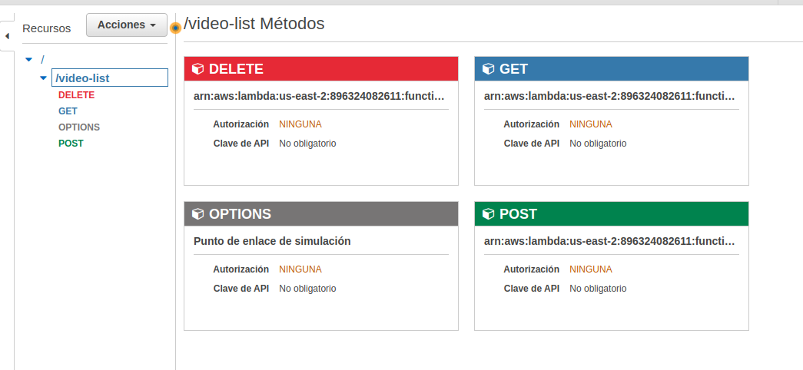
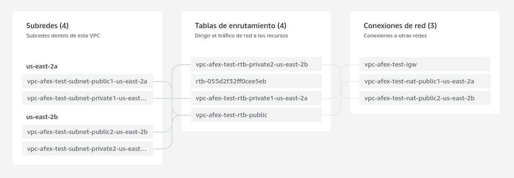

# Backend
## Descripcion  
El backend esta desarrollado con JS y node18. Esta desplegado en funciones lambda de AWS, las cuales estan manejadas como APIRest por API Gateway de AWS y la configuracion de VPC, subredes, gateways y net gateways para permitir la comunicacion entre serviucios de AWS y la salida a internet por parte de lambda functions y poder utilizar googleapis.

## Metodos en API gateway paraa el recurso **video-list**

## Resource map para **VPC**

## Estructura de los directorios
- `video-list/`: directorio correspondiente al **recurso** de nombre omonimo, este contiene sub directorios de los fuentes para funciones lambda para diferentes metodos asociados al recurso.
- `save/`: funcion para manejar el guardado de registros, recibe el ID de un video de youtube.
- `delete/`: funcion para manejar la eliminacion de registros, recibe el ID de un video de un documento.
- `list/`: Retorna todos los documentos de la coleccion.